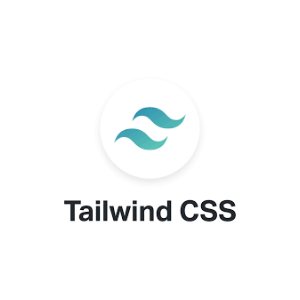
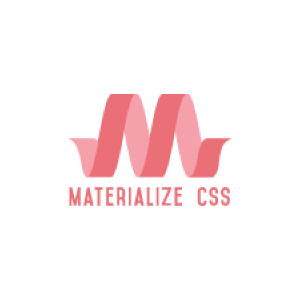
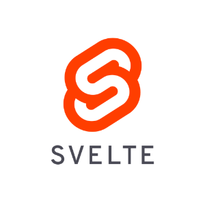

# Componentity.com

### Why waste your time writing the code that is already written?

Thousands of components ready to be copy-pasted!

Checkout [Componentity.com](https://componentity.com)

#### So far

1. **120** TailwindCss eye-catching components, blocks & sections</a>

## Versions

|TailwindCss|Bootstrap|MaterializeCss|SASS|React|VueJS|SvelteJS|WordPress|Flutter|Frontity|
| --- | --- | --- | --- | --- | --- | --- | --- | --- | ---| 
|   |    |    |    |    |    |    |    |    |    |

## Authors

1. [Yahya Makarim](https://github.com/mymakarim)

## Licensing

- Copyright 2020 @componentity
- Copyright 2020 @CodeNawis

## License :scroll:

  
